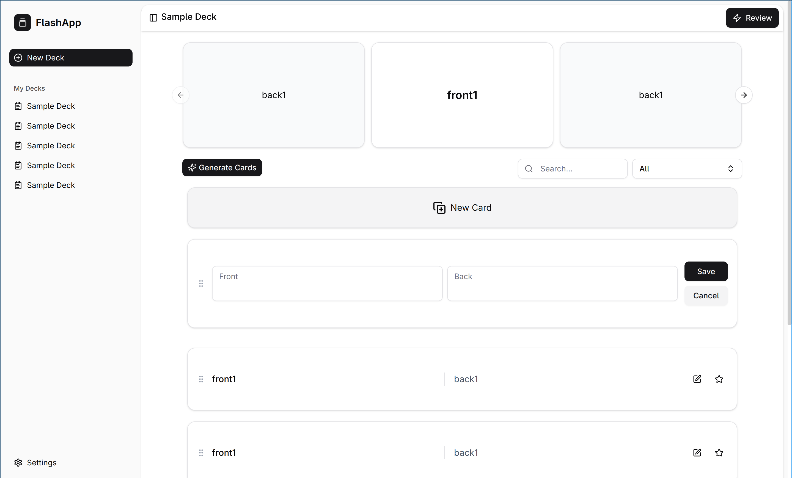

## FlashApp

FlashApp is an AI-powered desktop flashcard application that leverages Ollama for intelligent card generation. It integrates seamlessly with a local Ollama server, enabling AI capabilities to generate flashcards from various sources, making the learning process more efficient and personalized. Built with Electron, React, and TypeScript, FlashApp provides a smooth, native desktop experience for managing your study materials.

**Screenshot**

**Tech Stack**

       

## Features

-   **AI-Powered Flashcard Generation**: Leverage a local Ollama server to quickly generate flashcards from text, concepts, or topics.
-   **Comprehensive Flashcard Management**: Easily create, view, edit, and organize flashcards into custom decks.
-   **Interactive Study Sessions**: Engage in focused study modes designed to enhance retention and recall.
-   **Cross-Platform Desktop Experience**: Enjoy a native application on Windows, macOS, and Linux.
-   **Modern & Intuitive User Interface**: A clean, responsive design built with React, Tailwind CSS, and Shadcn UI.
-   **Local Data Storage**: All your flashcard data is stored securely on your local machine, ensuring privacy and offline accessibility.

---

**⭐ Star this repo if you find it helpful!**

Made with ❤️ by [joshperegrin](https://github.com/joshperegrin)

